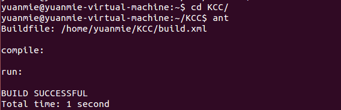
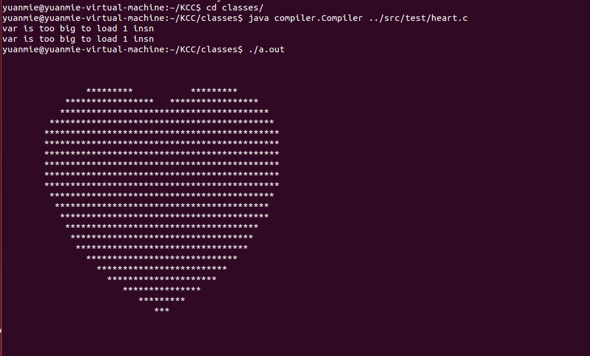

##  KCC

a simple c compiler in java.
<b>It is a incomplete project.</b>

### How to build
prepare:
* JDK8
* Ant
* 32 bit lib       
```shell
    sudo apt-get install -y  gcc-multilib g++-multilib libc6-i386 lib32ncurses5 lib32stdc++6
```

Then, you can use ant to build source code.
```
cd KCC  //cd source directory
ant
```
for example:  


### How to run

  ~~~shell
  shell: cd classes      //generated class directory
  shell:java compiler.Compiler source.c
  ~~~

for example:


### acknowledge:

* [cbc](https://github.com/aamine/cbc)
* [自制编译器](https://book.douban.com/subject/26806041/)
